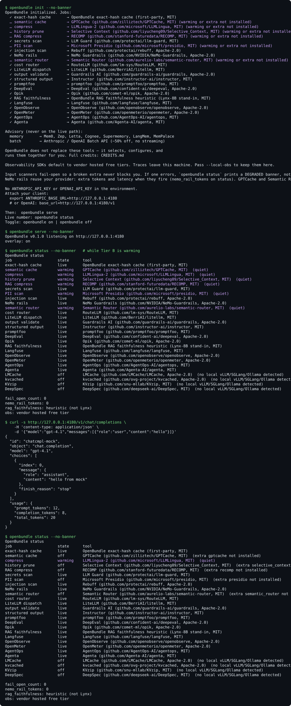

<p align="center">
  
</p>

<p align="center">
  <strong>You're paying for tokens you've already sent, prompts that still compress, and traffic you can't inspect.</strong>
</p>

<p align="center">The open-source caches, compressors, scanners, routers, eval, and obs tools that fix that already exist. They just don't install as one localhost overlay.</p>

<p align="center">
  
</p>

<p align="center">
  <a href="LICENSE"></a>
  <a href="https://www.python.org/"></a>
  <a href=".github/workflows/ci.yml"></a>
</p>

## Honest caveats

Read these before the catalog count.

| Claim | What it actually is |
|---|---|
| Live number | `openbundle status` on **this** traffic. Paper ranges are not multiplied into a ceiling. |
| NeMo rails | No bundled rail model. When dialogue rails fire they call **your** provider — extra tokens and latency, shown as `nemo_rail_tokens`. |
| GPTCache + Semantic Router | Two independent warming jobs. Sharing one embedding download is **unverified**. |
| LMCache / kvcached / KVzip | Self-hosted only, **not verified to work together**, and **not live** unless an adapter is constructed in this sidecar. |
| Lynx-8B | Not default-live. `--with-lynx` does not print Lynx unless the adapter actually constructs. Hosted-API users get a citation/overlap heuristic. |
| Observability | SDKs default to vendor hosted free tiers. **Traces leave this machine** unless `--self-host`. |
| Scanners | Secrets / PII / injection **fail-open**. A crash prints `DEGRADED:` — not a quiet `live`. Retry on the next request; success returns `live`; session `fail_open_count` stays. |
| This overlay | MIT, localhost, pre-seed. No moat. One named tool per job. |

<!-- HERO:START -->
**22 hosted-API jobs + 5 conditional = 27 named tools.** `openbundle status` is the live number on this traffic — not a multiplied ceiling.
<!-- HERO:END -->

```bash
pip install openbundle
openbundle init && openbundle serve
export ANTHROPIC_BASE_URL=http://127.0.0.1:4180   # or OPENAI_BASE_URL
```

Point Claude Code, Cursor, Aider, or any OpenAI/Anthropic-compatible client at that URL. Then:

```bash
openbundle status
```

`openbundle off` is full passthrough on the same URL. Repo and source are never touched.

## Install

```bash
pip install openbundle
openbundle init      # overlay yaml; Tier B starts warming; never touches your repo
openbundle serve     # http://127.0.0.1:4180
```

```bash
openbundle on | off      # same URL, repo untouched
openbundle attach        # Claude Code / Cursor / Codex env snippets
openbundle status        # live | warming | degraded | advisory | off
openbundle report        # before/after table for this session
openbundle uninstall     # --yes to skip the prompt
```

Flags: `--with-lynx` (Lynx-8B faithfulness, only if the adapter constructs) · `--self-host` (obs SDKs on localhost; `--local-obs` is an alias).

`openbundle attach` reprints the Claude Code / Cursor / Codex / Aider snippets for the current shell.

## Attach a coding agent

The sidecar is the only URL the agent should see. Set `OPENROUTER_API_KEY` (or a native Anthropic/OpenAI key) in the environment that runs `openbundle serve`.

```powershell
# Claude Code — this session, then `claude`
$env:ANTHROPIC_BASE_URL = "http://127.0.0.1:4180"
$env:ANTHROPIC_AUTH_TOKEN = "openbundle"
$env:ANTHROPIC_API_KEY = ""
```

Cursor: Settings → Models → OpenAI-compatible. Base URL `http://127.0.0.1:4180/v1`, API key `openbundle`.

Codex / other OpenAI CLIs: `OPENAI_BASE_URL=http://127.0.0.1:4180/v1` and `OPENAI_API_KEY=openbundle`.

Do not point the agent at `openrouter.ai` if you want OpenBundle in the path. If Claude Code was logged into Anthropic, `/logout` once, restart, then `/status`.

## Pipeline order

```text
exact-hash → semantic cache → compress (LLMLingua-2) → history prune (Selective Context)
  → RAG compress (RECOMP, if RAG) → secrets → PII → injection → NeMo rails
  → Semantic Router → RouteLLM → LiteLLM → provider
  → Guardrails AI → Instructor
  → eval trio (promptfoo / DeepEval / Opik, sampled, not blocking)
  → obs SDKs (Langfuse / OpenObserve / OpenMeter / AgentOps / Agenta)
```

Cache keys **original** messages. Compress only on miss. Scans before the request leaves the box. Output validation after the model that actually answered.

## The catalog

<!-- CATALOG:START -->
**22 live jobs** for hosted-API users, **5** more if self-hosted inference or `--with-lynx` is detected, plus **8** advisory tools (memory + batch). `openbundle status` is the live number. Full table: [CATALOG.md](CATALOG.md) · credits: [CREDITS.md](CREDITS.md).
<!-- CATALOG:END -->

Not this proxy (kept in the full catalog / credits, not on the live path): coalesce, prompt-cache inject, session hygiene, serving engines, quantizers, token-level constrained decoding, vector DBs, orchestration frameworks.

## Not another AI gateway

| | OpenBundle | Typical AI gateway |
|---|---|---|
| License | Fully open source (MIT) | Commercial or open-core |
| Runs where | Your machine only | Often a hosted control plane |
| Live number | `openbundle status` | Marketing ceiling |
| Attribution | Every active tool named | Varies |

## Security and data

- Binds `127.0.0.1` only; `--expose` is required (and warns) to bind wider.
- Input scanners fail-open: a crash does not drop the request. Status shows `DEGRADED:`, then retries on the next request.
- `~/.openbundle/samples.jsonl` stores a local, size-capped sample of recent prompts. Never transmitted anywhere. Disable with `OPENBUNDLE_NO_SAMPLES=1`.
- Provider errors and disconnects are forwarded as-is; failed turns are never cached.
- No virtual keys, no multi-tenant auth — this is a single-user local overlay.

## License

[MIT](LICENSE)
